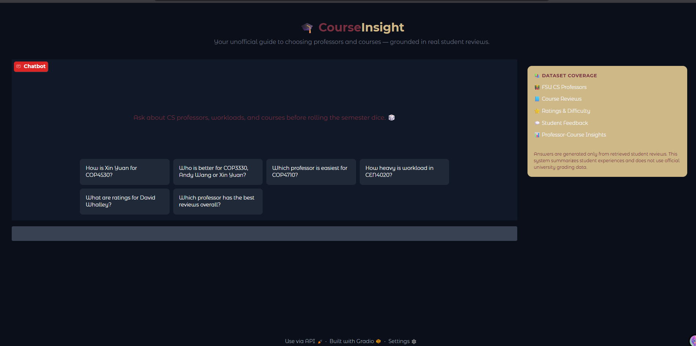

## Chatbot interface

## Domain

The Unofficial Guide covers student reviews and experiences of Florida State University (FSU) Computer Science professors and courses. This knowledge is valuable because official course catalogs and university websites provide course descriptions and instructor assignments but do not capture teaching quality, workload, grading style, attendance expectations, exam difficulty, or overall student sentiment. Student reviews provide insights that are difficult to obtain through official channels and are often important factors when students choose courses and professors.

---

## Document Sources

| #  | Source           | Type                     | URL or file path        |
| -- | ---------------- | ------------------------ | ----------------------- |
| 1  | RateMyProfessors | Consolidated Review Data | andy_wang.txt           |
| 2  | RateMyProfessors | Consolidated Review Data | daniel_schwartz.txt     |
| 3  | RateMyProfessors | Consolidated Review Data | david_whalley.txt       |
| 4  | RateMyProfessors | Consolidated Review Data | gary_tyson.txt          |
| 5  | RateMyProfessors | Consolidated Review Data | grigory_fedyukovich.txt |
| 6  | RateMyProfessors | Consolidated Review Data | peixiang_zhao.txt       |
| 7  | RateMyProfessors | Consolidated Review Data | weikuan_yu.txt          |
| 8  | RateMyProfessors | Consolidated Review Data | xian_mallory.txt        |
| 9  | RateMyProfessors | Consolidated Review Data | xin_yuan.txt            |
| 10 | RateMyProfessors | Consolidated Review Data | zhenhai_duan.txt        |

---

## Chunking Strategy

**Chunk size:** Not fixed-size chunking. Each chunk represents a complete professor-course summary or a professor summary.

**Overlap:** None.

**Why these choices fit your documents:**

The source documents are highly structured and contain reviews grouped by professor and course. Traditional fixed-size chunking would separate related reviews and reduce retrieval quality. Instead, reviews were aggregated into professor-course summary chunks containing statistics such as average quality, average difficulty, attendance patterns, textbook usage, grade distributions, and review summaries. An additional professor summary chunk was created for each professor to support ranking, recommendation, and comparison queries. This entity-centric chunking strategy preserves context and aligns retrieval units with the types of questions users ask.

**Final chunk count:** 44 chunks

---

## Embedding Model

**Model used:**

sentence-transformers/all-MiniLM-L6-v2

**Production tradeoff reflection:**

all-MiniLM-L6-v2 was selected because it is lightweight, fast, free to run locally, and performs well for semantic similarity tasks. If deploying for production without cost constraints, I would evaluate larger embedding models that provide stronger semantic understanding and ranking quality. Tradeoffs would include higher latency, increased storage requirements, API costs, multilingual support, domain adaptation capabilities, and longer context handling. Since the dataset is relatively small, retrieval speed was prioritized over embedding complexity.

---

## Grounded Generation

**System prompt grounding instruction:**

The system prompt explicitly instructs the LLM to answer only from retrieved context, never invent information, and acknowledge when sufficient information is unavailable. The prompt includes instructions such as:

* Use only the provided context.
* Never invent information.
* When information is missing, state that there is not enough information from student reviews.
* Use retrieved ratings, difficulty scores, and review themes when comparing or ranking professors.

Additionally, only the top retrieved chunks are passed to the model after metadata-aware re-ranking.

**How source attribution is surfaced in the response:**

Each response includes a Sources section generated from retrieved chunk metadata. Sources display the professor name and course when applicable, allowing users to see exactly which professor reviews contributed to the answer.

---

## Evaluation Report

| # | Question                       | Expected answer                     | System response (summarized)                                     | Retrieval quality  | Response accuracy  |
| - | ------------------------------ | ----------------------------------- | ---------------------------------------------------------------- | ------------------ | ------------------ |
| 1 | How is Xin Yuan for COP4530?   | Retrieve Xin Yuan COP4530 reviews   | Retrieved Xin Yuan COP4530 chunk and summarized student feedback | Relevant           | Accurate           |
| 2 | Compare Andy Wang and Xin Yuan | Compare both professors overall     | Retrieved both professor summaries and generated comparison      | Relevant           | Accurate           |
| 3 | Who is best for COP3330?       | Compare professors teaching COP3330 | Retrieved multiple COP3330 chunks and ranked professors          | Relevant           | Partially Accurate |
| 4 | Tell me about Xin Yuan         | Retrieve professor summary          | Retrieved professor summary and provided overview                | Relevant           | Accurate           |
| 5 | Who teaches COP4530?           | Return professors teaching COP4530  | Retrieved course-related chunks and identified instructors       | Partially Relevant | Partially Accurate |

---

## Failure Case Analysis

**Question that failed:**

Who is best for COP3330?

**What the system returned:**

The system initially retrieved only one professor-course chunk instead of all professors associated with COP3330.

**Root cause (tied to a specific pipeline stage):**

The issue occurred during retrieval. Semantic search alone prioritized the most semantically similar chunk instead of retrieving all professor-course chunks for the requested course. As a result, generation did not receive enough context to perform a meaningful comparison.

**What you would change to fix it:**

The retrieval layer was improved by introducing query classification and metadata-aware retrieval. For course recommendation questions, retrieval now explicitly fetches all chunks associated with the requested course before re-ranking, ensuring that generation receives complete comparison context.

---

## Spec Reflection

**One way the spec helped you during implementation:**

The planning process forced me to think about chunking, retrieval, and evaluation before writing code. Defining chunking and retrieval strategies early helped avoid redesigning the entire pipeline later and provided a clear roadmap for implementation.

**One way your implementation diverged from the spec, and why:**

The original plan assumed a more traditional chunking strategy. During implementation, I realized that professor review data is highly structured and better suited for aggregated entity-centric chunks. Instead of splitting text into fixed-size segments, I created professor-course summaries and professor summaries, which significantly improved retrieval quality and answer relevance.

---

## AI Usage

### Instance 1

* **What I gave the AI:** Sample professor review documents, desired retrieval behavior, and chunking requirements.
* **What it produced:** Parsing functions, aggregation strategies, and professor-course chunk structures.
* **What I changed or overrode:** I replaced traditional chunking suggestions with entity-centric chunking and added professor summary chunks to support ranking and comparison questions.

### Instance 2

* **What I gave the AI:** Retrieval failures, query examples, metadata structure, and desired user behavior.
* **What it produced:** Metadata-aware retrieval ideas, re-ranking logic, and query classification approaches.
* **What I changed or overrode:** I initially implemented a rule-based classifier but later introduced an LLM-based query classification system because the rule-based approach became difficult to maintain as query complexity increased.
