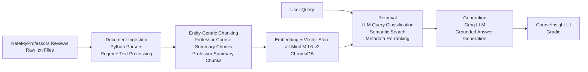

# Project 1 Planning: The Unofficial Guide - CourseInsight

## Domain

<!-- What domain did you choose? Why is this knowledge valuable and hard to find through official channels? -->

We chose the domain of university professor and course selection for Computer Science students at Florida State University.

This knowledge is valuable because choosing the right professor can significantly impact a student's learning experience, workload, course difficulty, and overall academic success. Students often want to know details such as teaching quality, grading style, workload expectations, attendance policies, exam difficulty, and whether previous students would recommend taking a course with a particular professor.

Finding this information through official channels is difficult because university course catalogs and faculty pages typically provide only basic information such as course descriptions, prerequisites, and instructor names. They rarely include insights about classroom experience, assignment difficulty, teaching effectiveness, or student satisfaction. As a result, students often rely on scattered sources such as student forums, social media discussions, and review websites, where information is fragmented and difficult to search effectively.

Our system consolidates student review data into a searchable knowledge base, allowing users to ask natural language questions about professors and courses and receive evidence-based answers grounded in real student experiences.


## Documents

<!-- List your specific sources: URLs, subreddit names, forum threads, or file descriptions.
     Aim for at least 10 sources that together cover different subtopics or perspectives within your domain. -->

| #  | Source           | Description                                                                                                                                           | URL or Location         |
| -- | ---------------- | ----------------------------------------------------------------------------------------------------------------------------------------------------- | ----------------------- |
| 1  | RateMyProfessors | Student reviews, ratings, difficulty scores, and course-specific feedback for Andy Wang. Data consolidated into a structured .txt document.           | https://www.ratemyprofessors.com/professor/2143679        |
| 2  | RateMyProfessors | Student reviews, ratings, difficulty scores, and course-specific feedback for Daniel Schwartz. Data consolidated into a structured .txt document.     | https://www.ratemyprofessors.com/professor/2368226    |
| 3  | RateMyProfessors | Student reviews, ratings, difficulty scores, and course-specific feedback for David Whalley. Data consolidated into a structured .txt document.       | https://www.ratemyprofessors.com/professor/1890966     |
| 4  | RateMyProfessors | Student reviews, ratings, difficulty scores, and course-specific feedback for Gary Tyson. Data consolidated into a structured .txt document.          | https://www.ratemyprofessors.com/professor/597394       |
| 5  | RateMyProfessors | Student reviews, ratings, difficulty scores, and course-specific feedback for Grigory Fedyukovich. Data consolidated into a structured .txt document. | https://www.ratemyprofessors.com/professor/2669103 |
| 6  | RateMyProfessors | Student reviews, ratings, difficulty scores, and course-specific feedback for Peixiang Zhao. Data consolidated into a structured .txt document.       | https://www.ratemyprofessors.com/professor/1895947    |
| 7  | RateMyProfessors | Student reviews, ratings, difficulty scores, and course-specific feedback for Weikuan Yu. Data consolidated into a structured .txt document.          | https://www.ratemyprofessors.com/professor/2237412       |
| 8  | RateMyProfessors | Student reviews, ratings, difficulty scores, and course-specific feedback for Xian Mallory. Data consolidated into a structured .txt document.        | https://www.ratemyprofessors.com/professor/2905343     |
| 9  | RateMyProfessors | Student reviews, ratings, difficulty scores, and course-specific feedback for Xin Yuan. Data consolidated into a structured .txt document.            | https://www.ratemyprofessors.com/professor/901262         |
| 10 | RateMyProfessors | Student reviews, ratings, difficulty scores, and course-specific feedback for Zhenhai Duan. Data consolidated into a structured .txt document.        | https://www.ratemyprofessors.com/professor/1819911      |


---

## Chunking Strategy

<!-- How will you split documents into chunks?
     State your chunk size (in tokens or characters), overlap size, and explain why those
     numbers fit the structure of your documents.
     A review-heavy corpus warrants different chunking than a long FAQ. -->

**Chunk size:**
Semantic, document-structure-based chunks rather than fixed token or character sizes.

Each chunk represents one of the following:

A Professor + Course Summary Chunk containing aggregated statistics and student reviews for a specific professor-course combination.
A Professor Summary Chunk containing overall professor ratings, difficulty, and aggregated information across all courses taught by that professor.

Typical chunk sizes range from approximately 500–3000 words, depending on the number of reviews available for a professor-course combination.
**Overlap:**
No overlap (0%).
**Reasoning:**
Traditional chunking strategies such as fixed-size, recursive, or sliding-window chunking are designed for long continuous documents where information may span multiple sections. Our dataset is highly structured and naturally organized by professor and course.

Instead of splitting text arbitrarily, we use an entity-centric chunking strategy, where each chunk corresponds to a meaningful retrieval unit:

Professor + Course
Professor Overall Summary

During ingestion, all reviews belonging to a professor-course pair are aggregated into a single chunk. Statistics such as average quality, average difficulty, attendance patterns, grade distributions, textbook usage, and review counts are computed and included alongside the original review content.

This approach preserves complete context for retrieval and avoids situations where individual reviews are retrieved without sufficient surrounding information. It also enables efficient retrieval for questions such as:

"How is Xin Yuan for COP4530?"
"Who is the best professor for COP3330?"
"Compare Andy Wang and Xin Yuan."
"Who is the best professor overall?"

Because each chunk already contains complete contextual information for a professor-course combination, overlap is unnecessary and would only increase storage redundancy without improving retrieval quality.
---

## Retrieval Approach

<!-- Which embedding model are you using (e.g., all-MiniLM-L6-v2 via sentence-transformers)?
     How many chunks will you retrieve per query (top-k)?
     If you were deploying this for real users and cost wasn't a constraint, what tradeoffs
     would you weigh in choosing a different embedding model — context length, multilingual
     support, accuracy on domain-specific text, latency? -->

**Embedding model:**
all-MiniLM-L6-v2 from Sentence Transformers (used through ChromaDB's embedding pipeline).

This model converts each professor-course chunk and professor summary chunk into dense vector embeddings, enabling semantic similarity search between user questions and stored review data.
**Top-k:**
Two-stage retrieval:

Initial Retrieval (Vector Search): Top 15 chunks
Re-ranking and Context Selection: Top 5 chunks

The system first retrieves the 15 most semantically similar chunks from ChromaDB. A lightweight re-ranking stage then boosts chunks based on detected professor names, course codes, and query intent. Finally, the top 5 most relevant chunks are passed to the LLM as context.

This approach balances retrieval recall and context quality. Retrieving too few chunks risks missing relevant professors or courses, while retrieving too many chunks can introduce noise and consume unnecessary context window space.
**Production tradeoff reflection:**
If cost and latency were not constraints, several alternative embedding models could be considered.

Larger embedding models generally provide better semantic understanding and retrieval accuracy, especially for nuanced review text and recommendation-style queries.
Models with longer context windows could better capture relationships between multiple reviews and course summaries.
Multilingual embedding models would be beneficial if reviews were collected from multiple languages.
Domain-specific models trained on educational or review-based datasets might better understand concepts such as grading difficulty, workload, lecture quality, and attendance expectations.

However, these improvements typically come with tradeoffs:

Factor	Larger Models	Current Model (all-MiniLM-L6-v2)
Retrieval Accuracy	Higher	Good
Latency	Higher	Low
Memory Usage	Higher	Low
Storage Requirements	Higher	Low
Cost	Higher	Minimal

For this project, all-MiniLM-L6-v2 was selected because it provides strong retrieval performance while remaining lightweight, fast, and easy to deploy on commodity hardware. Given the relatively small dataset size and structured nature of professor reviews, the model offers an effective balance between accuracy and efficiency.
---

## Evaluation Plan

<!-- List your 5 test questions with their expected correct answers.
     Questions should be specific enough that you can judge whether the system's response
     is right or wrong. "What are good dining halls?" is too vague.
     "What do students say about wait times at [dining hall name] during lunch?" is testable. -->

#	Question	Expected Answer
1	How is Xin Yuan for COP4530?	The response should summarize Xin Yuan's reviews for COP4530, including average ratings, difficulty, workload, and common student feedback themes from the COP4530 course chunk.
2	Compare Andy Wang and Xin Yuan overall.	The response should retrieve and compare both professors' summary chunks, including overall ratings, difficulty, review counts, and major strengths or weaknesses mentioned by students.
3	Who teaches COP4530?	The response should identify professors associated with COP4530 in the dataset, such as Xin Yuan, Weikuan Yu, Xian Mallory, and Zhenhai Duan.
4	Which professor is easiest for COP3330?	The response should compare professors teaching COP3330 using available difficulty statistics and student reviews, then explain the recommendation using retrieved evidence.
5	Tell me about Grigory Fedyukovich.	The response should use the professor summary chunk to describe his overall rating, overall difficulty, courses taught, review trends, and common student opinions.
Success Criteria

A response is considered correct if:

Relevant professor and course chunks are successfully retrieved.
The answer is grounded only in retrieved student review data.
The response accurately summarizes ratings and review themes.
No unsupported or hallucinated information is introduced.
Comparisons and recommendations are supported by retrieved evidence.
---

## Anticipated Challenges

## Anticipated Challenges

### 1. Subjective and Inconsistent Student Reviews

The source data consists of student-generated reviews, which are inherently subjective. Different students may have very different experiences with the same professor or course. For example, one student may describe a professor as engaging and knowledgeable, while another may describe the same professor as difficult or ineffective. This can make it challenging for the system to generate balanced summaries and recommendations.

**Mitigation:** During ingestion, reviews are aggregated at the professor-course level and summary statistics such as average quality, average difficulty, attendance patterns, and review counts are included alongside the original review content. This helps the model consider overall trends rather than relying on a single opinion.

### 2. Retrieval of Incomplete or Irrelevant Context

Some user questions may require information spanning multiple chunks. For example, questions such as "Who is the best professor for COP3330?" or "Compare all professors" require retrieval of multiple professor-course summaries. A purely semantic search may retrieve only a subset of the relevant chunks, leading to incomplete comparisons.

**Mitigation:** The retrieval pipeline combines semantic vector search with metadata-aware re-ranking based on detected professor names, course codes, and query intent. This improves the likelihood that all relevant chunks are included in the final context passed to the LLM.

### 3. Limited Coverage of the Dataset

The system can only answer questions about professors and courses present in the collected dataset. Users may ask about courses, professors, or subjects that do not exist in the knowledge base, resulting in insufficient context for answer generation.

**Mitigation:** The application is designed to acknowledge when relevant information is unavailable and instructs the LLM to avoid generating unsupported answers when sufficient evidence cannot be retrieved.

### 4. Recommendation and Ranking Queries

Questions such as "Who is the best professor?" or "Who is the easiest professor for COP3330?" require comparative reasoning across multiple chunks rather than simple retrieval. The quality of the answer depends on retrieving all relevant professors and accurately synthesizing their ratings and review trends.

**Mitigation:** Dedicated query classification and re-ranking logic are used to identify ranking and comparison questions, allowing the system to retrieve a broader set of relevant professor summaries before generating a response.

1.

2.

---

## Architecture

<!-- Draw a diagram of your pipeline showing the five stages:
     Document Ingestion → Chunking → Embedding + Vector Store → Retrieval → Generation
     Label each stage with the tool or library you're using.
     You can use ASCII art, a Mermaid diagram, or embed a sketch as an image.
     You'll use this diagram as context when prompting AI tools to implement each stage. -->

## Architecture



### Stage 1: Document Ingestion

* Source: RateMyProfessors review data
* Tooling: Python, regex parsing, text processing
* Converts raw review files into structured professor and course data

### Stage 2: Chunking

* Entity-centric chunking strategy
* Creates:

  * Professor-Course Summary Chunks
  * Professor Summary Chunks
* Aggregates ratings, difficulty, attendance patterns, grades, and review statistics

### Stage 3: Embedding + Vector Store

* Embedding Model: all-MiniLM-L6-v2
* Vector Database: ChromaDB
* Stores chunk text together with metadata:

  * Professor Name
  * Course Code
  * Chunk Type

### Stage 4: Retrieval

* LLM-based query classification
* Entity extraction for professors and courses
* Semantic retrieval from ChromaDB
* Metadata-aware re-ranking
* Returns the most relevant chunks as context

### Stage 5: Generation

* LLM generates responses using only retrieved context
* Supports:

  * Professor lookups
  * Course lookups
  * Comparisons
  * Recommendations
  * Rankings
* Responses are displayed through the CourseInsight Gradio interface

```
```

---

## AI Tool Plan

<!-- For each part of the pipeline below, describe:
     - Which AI tool you plan to use (Claude, Copilot, ChatGPT, etc.)
     - What you'll give it as input (which sections of this planning.md, which requirements)
     - What you expect it to produce
     - How you'll verify the output matches your spec

     "I'll use AI to help me code" is not a plan.
     "I'll give Claude my Chunking Strategy section and ask it to implement chunk_text()
     with my specified chunk size and overlap" is a plan. -->

### Milestone 3 — Ingestion and Chunking

**AI Tool Used:** ChatGPT

**Input Provided:**

* Sample RateMyProfessors documents
* Desired architecture for professor and course recommendations
* Requirements for professor-level and course-level retrieval

**Expected Output:**

* Parsing functions to extract professor information, course information, ratings, and reviews
* Aggregation logic to convert raw reviews into structured retrieval units
* Chunk construction functions

**How Output Was Verified:**

* Parsed outputs were manually inspected against the source documents.
* Aggregated statistics such as average quality, average difficulty, attendance counts, and review counts were validated using sample professor files.
* Generated chunks were reviewed to ensure they contained sufficient information to answer professor and course-related questions.

**Reflection:**
Initially, I considered traditional chunking approaches such as fixed-size and recursive chunking. Through discussions with ChatGPT, I realized that professor reviews are highly structured and do not benefit from arbitrary text splitting. This led to the decision to use entity-centric chunking, where each chunk represents either a Professor-Course summary or a Professor Summary.

---

### Milestone 4 — Embedding and Retrieval

**AI Tool Used:** ChatGPT

**Input Provided:**

* Chunk structure
* Metadata design
* Retrieval requirements
* Example user questions and expected behavior

**Expected Output:**

* ChromaDB storage design
* Metadata strategy
* Retrieval and re-ranking logic
* Query classification ideas

**How Output Was Verified:**

* Retrieval was tested using professor-specific, course-specific, comparison, recommendation, ranking, and listing queries.
* Retrieved chunks were inspected before generation to confirm that relevant context was being returned.
* Multiple edge cases were tested, including questions involving multiple professors, unknown professors, rankings, and recommendations.

**Reflection:**
The retrieval stage required the most iteration. Early versions relied entirely on semantic retrieval, which performed well for direct questions but struggled with ranking, comparison, and recommendation queries. ChatGPT suggested introducing metadata such as professor name, course code, and chunk type. This resulted in a more reliable retrieval strategy where semantic similarity was combined with metadata-aware re-ranking.

As testing continued, rule-based classification became difficult to maintain for the growing number of query types. To improve flexibility and coverage, an LLM-based query classifier was introduced. This classifier determines the user's intent and helps guide retrieval toward the most relevant chunks.

---

### Milestone 5 — Generation and Interface

**AI Tool Used:** ChatGPT

**Input Provided:**

* Retrieved chunk structure
* Query categories
* Grounding requirements
* Desired user experience

**Expected Output:**

* Prompt templates
* Grounded generation strategy
* Gradio interface design suggestions

**How Output Was Verified:**

* Generated responses were compared against retrieved chunks to ensure factual consistency.
* Queries from all supported categories were tested to verify that answers remained grounded in retrieved student reviews.
* Cases with insufficient information were tested to ensure the model explicitly acknowledged missing context rather than generating unsupported answers.

**Reflection:**
The final generation stage was designed so that most reasoning occurs after retrieval has already selected the appropriate professor and course information. Since the chunks contain aggregated statistics and review summaries, the LLM primarily performs summarization, comparison, recommendation, and explanation. Prompt engineering was used to maintain groundedness and prevent hallucinations, ensuring that answers are based only on retrieved student review data.

